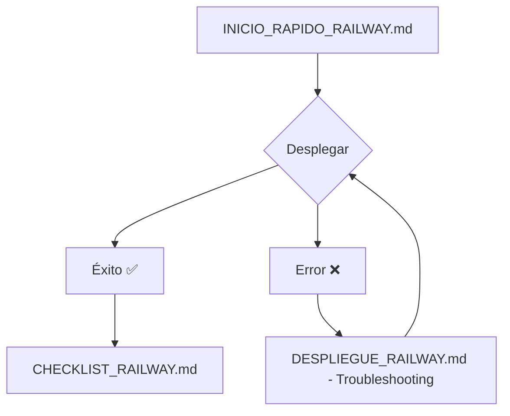

# 🚀 Despliegue del Sistema de Horarios FICCT en Railway

## ⚡ Inicio Rápido - 30 Minutos

### 📖 Lee este documento primero: [`INICIO_RAPIDO_RAILWAY.md`](INICIO_RAPIDO_RAILWAY.md)

Esta guía te llevará paso a paso para desplegar la aplicación en Railway en menos de 30 minutos.

---

## 📚 Documentación Disponible

| Documento | Descripción | Tiempo | Para Quién |
|-----------|-------------|--------|------------|
| **[INICIO_RAPIDO_RAILWAY.md](INICIO_RAPIDO_RAILWAY.md)** | Guía rápida de 5 pasos | 30 min | Principiantes ⭐ |
| **[PLAN_DESPLIEGUE_RAILWAY.md](PLAN_DESPLIEGUE_RAILWAY.md)** | Plan completo por fases | 40 min | Todos 📖 |
| **[DESPLIEGUE_RAILWAY.md](DESPLIEGUE_RAILWAY.md)** | Documentación exhaustiva | Variable | Referencia 📚 |
| **[CHECKLIST_RAILWAY.md](CHECKLIST_RAILWAY.md)** | Lista de verificación | 20-50 min | Verificación ✅ |
| **[INDICE_DESPLIEGUE_RAILWAY.md](INDICE_DESPLIEGUE_RAILWAY.md)** | Índice de navegación | - | Navegación 🗂️ |

---

## ✅ Estado del Proyecto

- ✅ **Código**: Listo y actualizado en GitHub
- ✅ **Dockerfile**: Configurado y optimizado
- ✅ **Variables**: Preparadas en `.env.production` (local)
- ✅ **APP_KEY**: Generado y listo para usar
- ✅ **Documentación**: Completa y paso a paso

---

## 🎯 ¿Qué Necesitas?

### Pre-requisitos

1. **Cuenta en Railway**: https://railway.app (usa tu GitHub)
2. **Este repositorio en GitHub**: Ya lo tienes ✅
3. **30 minutos de tiempo**
4. **Navegador web**

### NO Necesitas

- ❌ Tarjeta de crédito (plan gratuito disponible)
- ❌ Conocimientos de Docker
- ❌ Servidor propio
- ❌ Configurar SSL/HTTPS (Railway lo hace automáticamente)

---

## 🚀 Comenzar Ahora

### Paso 1: Abre la guía rápida

```bash
# Abre este archivo en tu editor:
INICIO_RAPIDO_RAILWAY.md
```

### Paso 2: Sigue los 5 pasos

1. **Preparación** (2 min) - Ya está lista ✅
2. **Crear proyecto en Railway** (5 min)
3. **Configurar variables** (5 min)
4. **Desplegar** (10-15 min)
5. **Verificar** (5 min)

### Paso 3: ¡Disfruta tu aplicación en producción!

```
https://tu-proyecto.up.railway.app
```

---

## 📊 Información Clave

### APP_KEY Generado

```
base64:pSnzfPY1QRO2MVWlmwj13TAoEAKYsKNUmqs9k0Bzw6w=
```

**Cópialo**: Lo necesitarás al configurar variables en Railway

### Credenciales Iniciales

```
Email: admin@ficct.edu.bo
Password: admin123
```

⚠️ **Cambiar después del primer login**

### URL Temporal de Railway

```
https://sistema-horarios-ficct-production.up.railway.app
```

(Se actualizará con tu URL real después del despliegue)

---

## 🎓 Flujo Recomendado



### Para Principiantes

1. Lee: **INICIO_RAPIDO_RAILWAY.md**
2. Ejecuta: Sigue los 5 pasos
3. Verifica: **CHECKLIST_RAILWAY.md**

### Para Expertos

1. Consulta: **PLAN_DESPLIEGUE_RAILWAY.md**
2. Ejecuta: Fases 1-6
3. Optimiza: Fase de Monitoreo

---

## 🔧 Tecnologías

- **Framework**: Laravel 10.x
- **Base de Datos**: PostgreSQL 16
- **Servidor Web**: Nginx
- **PHP**: 8.4-fpm
- **Node.js**: 20.x
- **Plataforma**: Railway.app
- **Contenedor**: Docker

---

## 💰 Costos

### Plan Gratuito (Hobby)

```
✓ $5 USD de crédito/mes
✓ 500 horas de ejecución
✓ 1 GB de transferencia
✓ SSL incluido
✓ Dominios personalizados
```

**Costo estimado para este proyecto**: $2-4 USD/mes (dentro del plan gratuito)

---

## 📞 Soporte

### Documentación
- Railway: https://docs.railway.app
- Laravel: https://laravel.com/docs/deployment

### Comunidad
- Railway Discord: https://discord.gg/railway
- Railway Status: https://status.railway.app

### Comandos Útiles

```powershell
# Instalar Railway CLI
npm install -g @railway/cli

# Ver logs
railway logs

# Ejecutar comandos
railway run php artisan migrate
railway run php artisan cache:clear
```

---

## 🆘 Problemas Comunes

| Error | Solución Rápida | Documento |
|-------|----------------|-----------|
| Error 500 | Verificar APP_KEY | DESPLIEGUE_RAILWAY.md |
| Base de datos | Verificar referencias `${{Postgres.*}}` | PLAN_DESPLIEGUE_RAILWAY.md |
| CSS no carga | Limpiar cache | INICIO_RAPIDO_RAILWAY.md |
| Login falla | Ejecutar seeders | CHECKLIST_RAILWAY.md |

---

## 📈 Después del Despliegue

### Inmediato
- [ ] Cambiar contraseña admin
- [ ] Explorar módulos
- [ ] Crear usuarios de prueba

### Dentro de 1 semana
- [ ] Monitorear logs (`railway logs`)
- [ ] Verificar métricas de uso
- [ ] Configurar dominio personalizado (opcional)

### Mensual
- [ ] Revisar costos en Railway
- [ ] Backup de base de datos
- [ ] Actualizar dependencias

---

## ✅ Checklist Rápido

**Antes de Empezar**:
- [ ] Cuenta en Railway creada
- [ ] Código actualizado en GitHub
- [ ] Documentación revisada

**Durante el Despliegue**:
- [ ] Proyecto creado en Railway
- [ ] PostgreSQL agregado
- [ ] Variables configuradas
- [ ] APP_KEY copiado correctamente

**Después del Despliegue**:
- [ ] URL accesible
- [ ] Login funciona
- [ ] CSS carga
- [ ] HTTPS activo

---

## 🎉 ¡Estás Listo!

### Tu Próxima Acción

**→ Abre: [`INICIO_RAPIDO_RAILWAY.md`](INICIO_RAPIDO_RAILWAY.md)**

En 30 minutos tendrás tu aplicación en producción 🚀

---

## 📝 Notas Importantes

1. **APP_KEY ya generado**: No necesitas generarlo de nuevo
2. **Variables listas**: Usa `.env.production` como referencia
3. **Dockerfile optimizado**: Multi-stage build para reducir tamaño
4. **Seeders automáticos**: Los datos iniciales se cargan automáticamente
5. **SSL automático**: Railway configura HTTPS sin intervención

---

## 🔄 Actualizaciones Futuras

Para actualizar la aplicación en Railway:

```bash
# 1. Hacer cambios localmente
git add .
git commit -m "feat: nueva funcionalidad"

# 2. Push a GitHub
git push origin main

# 3. Railway despliega automáticamente
# Ver progreso en Railway Dashboard
```

---

**Última actualización**: 13 de noviembre de 2024

**Repositorio**: herlinaguileras/sistema-horarios-ficct

**Mantenedor**: Sistema de Horarios FICCT

---

**¿Listo para desplegar?** → [`INICIO_RAPIDO_RAILWAY.md`](INICIO_RAPIDO_RAILWAY.md) 🚀
