# 🎨 Diagrama ER Visual - Sistema de Horarios FICCT

## Diagrama Entidad-Relación en PlantUML

```plantuml
@startuml database_er_diagram

' Configuración
skinparam linetype ortho
skinparam roundcorner 10
skinparam backgroundColor #FEFEFE

' === MÓDULO DE AUTENTICACIÓN Y USUARIOS ===

entity "users" as users {
  * **id** : BIGINT <<PK>>
  --
  * name : VARCHAR(255)
  * email : VARCHAR(255) <<UNIQUE>>
  email_verified_at : TIMESTAMP
  * password : VARCHAR(255)
  remember_token : VARCHAR(100)
  created_at : TIMESTAMP
  updated_at : TIMESTAMP
}

entity "roles" as roles {
  * **id** : BIGINT <<PK>>
  --
  * name : VARCHAR(255) <<UNIQUE>>
  description : TEXT
  * level : INTEGER
  * status : ENUM('Activo','Inactivo')
  created_at : TIMESTAMP
  updated_at : TIMESTAMP
}

entity "permissions" as permissions {
  * **id** : BIGINT <<PK>>
  --
  * name : VARCHAR(255) <<UNIQUE>>
  description : TEXT
  module : VARCHAR(255)
  created_at : TIMESTAMP
  updated_at : TIMESTAMP
}

entity "role_user" as role_user {
  * **user_id** : BIGINT <<PK,FK>>
  * **role_id** : BIGINT <<PK,FK>>
}

entity "permission_role" as permission_role {
  * **id** : BIGINT <<PK>>
  --
  * permission_id : BIGINT <<FK>>
  * role_id : BIGINT <<FK>>
  created_at : TIMESTAMP
  updated_at : TIMESTAMP
}

' === MÓDULO DE DOCENTES ===

entity "docentes" as docentes {
  * **id** : BIGINT <<PK>>
  --
  * user_id : BIGINT <<FK>> <<UNIQUE>>
  * codigo_docente : VARCHAR(255) <<UNIQUE>>
  * carnet_identidad : VARCHAR(255)
  telefono : VARCHAR(255)
  * facultad : VARCHAR(255)
  * estado : VARCHAR(255)
  fecha_contratacion : DATE
  created_at : TIMESTAMP
  updated_at : TIMESTAMP
}

entity "titulos" as titulos {
  * **id** : BIGINT <<PK>>
  --
  * docente_id : BIGINT <<FK>>
  * nombre : VARCHAR(255)
  created_at : TIMESTAMP
  updated_at : TIMESTAMP
}

' === MÓDULO ACADÉMICO ===

entity "semestres" as semestres {
  * **id** : BIGINT <<PK>>
  --
  * nombre : VARCHAR(255) <<UNIQUE>>
  * fecha_inicio : DATE
  * fecha_fin : DATE
  * estado : VARCHAR(255)
  created_at : TIMESTAMP
  updated_at : TIMESTAMP
}

entity "materias" as materias {
  * **id** : BIGINT <<PK>>
  --
  * nombre : VARCHAR(255)
  * sigla : VARCHAR(255) <<UNIQUE>>
  * nivel_semestre : INTEGER
  * carrera : VARCHAR(255)
  created_at : TIMESTAMP
  updated_at : TIMESTAMP
}

entity "aulas" as aulas {
  * **id** : BIGINT <<PK>>
  --
  * nombre : VARCHAR(255) <<UNIQUE>>
  * piso : INTEGER
  capacidad : INTEGER
  tipo : VARCHAR(255)
  created_at : TIMESTAMP
  updated_at : TIMESTAMP
}

' === MÓDULO DE CARGA HORARIA ===

entity "grupos" as grupos {
  * **id** : BIGINT <<PK>>
  --
  * semestre_id : BIGINT <<FK>>
  * materia_id : BIGINT <<FK>>
  * docente_id : BIGINT <<FK>>
  * nombre : VARCHAR(255)
  created_at : TIMESTAMP
  updated_at : TIMESTAMP
}

entity "horarios" as horarios {
  * **id** : BIGINT <<PK>>
  --
  * grupo_id : BIGINT <<FK>>
  * aula_id : BIGINT <<FK>>
  * dia_semana : TINYINT
  * hora_inicio : TIME
  * hora_fin : TIME
  created_at : TIMESTAMP
  updated_at : TIMESTAMP
}

' === MÓDULO DE ASISTENCIAS ===

entity "asistencias" as asistencias {
  * **id** : BIGINT <<PK>>
  --
  * horario_id : BIGINT <<FK>>
  * docente_id : BIGINT <<FK>>
  * fecha : DATE
  * hora_registro : TIME
  * estado : VARCHAR(255)
  metodo_registro : VARCHAR(255)
  justificacion : TEXT
  created_at : TIMESTAMP
  updated_at : TIMESTAMP
}

' === RELACIONES ===

' Autenticación
users ||--o{ role_user : "M:N"
roles ||--o{ role_user : "M:N"
roles ||--o{ permission_role : "M:N"
permissions ||--o{ permission_role : "M:N"

' Docentes
users ||--|| docentes : "1:1"
docentes ||--o{ titulos : "1:N"

' Grupos
semestres ||--o{ grupos : "1:N"
materias ||--o{ grupos : "1:N"
docentes ||--o{ grupos : "1:N"

' Horarios
grupos ||--o{ horarios : "1:N"
aulas ||--o{ horarios : "1:N"

' Asistencias
horarios ||--o{ asistencias : "1:N"
docentes ||--o{ asistencias : "1:N"

@enduml
```



---

## Diagrama de Flujo de Datos Simplificado

```
┌─────────────────────────────────────────────────────────────┐
│                      SISTEMA DE HORARIOS                     │
└─────────────────────────────────────────────────────────────┘

      USUARIO ADMIN                    USUARIO DOCENTE
           │                                  │
           │ Login                            │ Login
           ▼                                  ▼
    ┌─────────────┐                    ┌─────────────┐
    │    users    │◄───────────────────│    users    │
    │  + roles    │                    │  + roles    │
    └──────┬──────┘                    └──────┬──────┘
           │                                  │
           │ hasOne                           │ hasOne
           ▼                                  ▼
    ┌─────────────┐                    ┌─────────────┐
    │  (sin       │                    │   docentes  │
    │  docente)   │                    │  + titulos  │
    └─────────────┘                    └──────┬──────┘
                                              │
           ┌──────────────────────────────────┤
           │ Gestiona                         │ Registra
           ▼                                  ▼
    ┌─────────────┐    ┌─────────────┐    ┌─────────────┐
    │  semestres  │    │   materias  │    │ asistencias │
    └──────┬──────┘    └──────┬──────┘    └──────┬──────┘
           │                  │                  │
           └────┬─────────────┘                  │
                │ N:1:1                          │
                ▼                                │
         ┌─────────────┐                         │
         │   grupos    │                         │
         │ + docente   │                         │
         └──────┬──────┘                         │
                │                                │
                │ 1:N                            │
                ▼                                │
         ┌─────────────┐                         │
         │  horarios   │◄────────────────────────┘
         │  + aula     │
         └─────────────┘
```

---

## Diagrama de Casos de Uso por Módulo

### Módulo de Usuarios y Roles

```
        ADMIN
          │
          ├─── Crear Usuarios
          ├─── Asignar Roles
          ├─── Gestionar Permisos
          ├─── Ver Usuarios
          └─── Editar/Eliminar Usuarios
```

### Módulo de Docentes

```
        ADMIN
          │
          ├─── Registrar Docente
          ├─── Asignar Títulos
          ├─── Ver Lista Docentes
          └─── Editar/Inactivar Docente
```

### Módulo de Carga Horaria

```
        ADMIN
          │
          ├─── Crear Semestre
          ├─── Crear Materias
          ├─── Crear Aulas
          ├─── Asignar Grupos
          │    (Docente + Materia + Semestre)
          └─── Definir Horarios
               (Grupo + Aula + Día + Hora)
```

### Módulo de Asistencias

```
       DOCENTE
          │
          ├─── Ver Mi Horario
          ├─── Marcar Asistencia (QR)
          └─── Ver Mi Historial

        ADMIN
          │
          ├─── Ver Todas las Asistencias
          ├─── Generar Reportes
          └─── Exportar Excel/PDF
```

---

## Diagrama de Estados - Semestre

```
    ┌──────────────┐
    │ Planificación│
    └───────┬──────┘
            │ Activar
            ▼
    ┌──────────────┐
    │    Activo    │
    └───────┬──────┘
            │ Finalizar
            ▼
    ┌──────────────┐
    │  Finalizado  │
    └──────────────┘
```

---

## Diagrama de Estados - Asistencia

```
    ┌──────────────┐
    │   Presente   │◄─── Marcó QR a tiempo
    └──────────────┘

    ┌──────────────┐
    │   Ausente    │◄─── No marcó asistencia
    └──────────────┘

    ┌──────────────┐
    │   Licencia   │◄─── Justificó ausencia
    └──────────────┘

    ┌──────────────┐
    │   Tardanza   │◄─── Marcó fuera de horario
    └──────────────┘
```

---

## Diccionario de Colores (Opcional para Diagrama)

| Módulo | Color | Hex |
|--------|-------|-----|
| Autenticación | Azul | #4A90E2 |
| Docentes | Verde | #7ED321 |
| Académico | Naranja | #F5A623 |
| Carga Horaria | Morado | #9013FE |
| Asistencias | Rojo | #D0021B |

---

## Exportar Diagrama PlantUML

### Online
1. Visitar: https://www.plantuml.com/plantuml/uml/
2. Pegar el código PlantUML
3. Click en "Submit"
4. Descargar como PNG, SVG o PDF

### Localmente (VSCode)
1. Instalar extensión: "PlantUML"
2. Abrir archivo `.puml` o `.plantuml`
3. Presionar `Alt+D` para previsualizar
4. Click derecho → "Export Current Diagram"

### CLI (si tienes Java instalado)
```bash
# Instalar PlantUML
brew install plantuml  # Mac
choco install plantuml # Windows

# Generar PNG
plantuml database_er_diagram.puml

# Generar SVG
plantuml -tsvg database_er_diagram.puml
```

---

**Fecha:** 27 de Octubre, 2025  
**Herramienta:** PlantUML  
**Formato:** Diagrama ER + Casos de Uso
